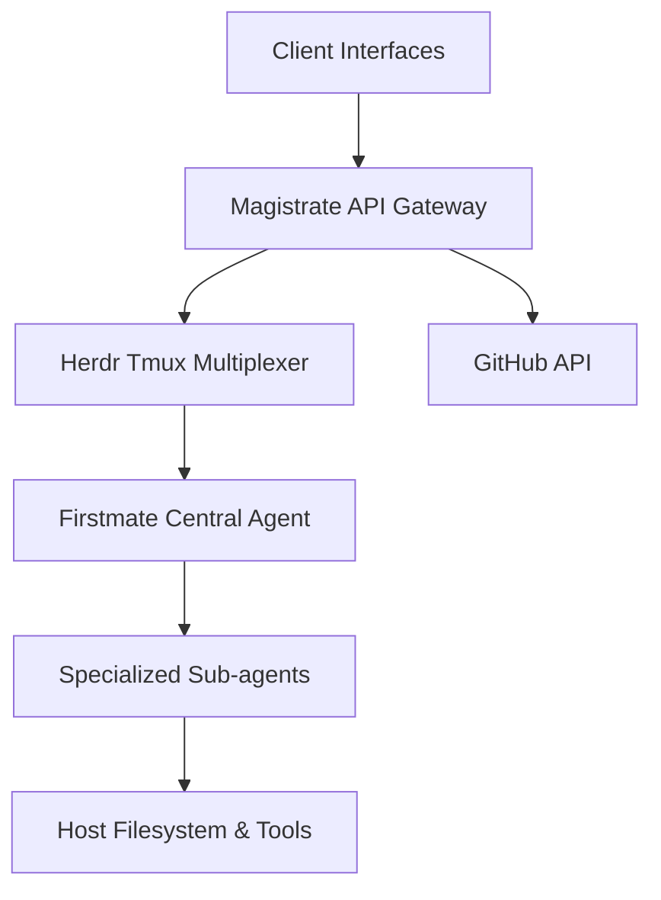

# Magistrate

**Magistrate** is a unified command center designed for multi-agent software development. 

## Vision

The broader goal of Magistrate is to make multi-agent software engineering accessible, steerable, and highly observable. Rather than juggling isolated chat windows or opaque background scripts, Magistrate provides a central interface to monitor and direct a coordinated crew of AI agents. 

Magistrate ensures that agentic workflows are:
- **Simple**: A single point of interaction for the human engineer, with meaningful escalations only when necessary.
- **Safe**: Work is isolated, operations are guarded, and merge approvals are explicitly required.
- **Observable**: Every agent's state, terminal output, and blockages remain highly visible in real-time.
- **Scalable**: Capable of supervising persistent, long-running agent domains as the fleet expands.

## Core Architecture

Magistrate acts as the integration layer between the human operator (via mobile and web interfaces) and the backend agent runners.



### Component Breakdown

| Component | Technology | Responsibility |
|-----------|------------|----------------|
| **Frontend** | React Native / Expo | Provides the cross-platform UI (iOS/Web) for observing agent state, reviewing PRs, and issuing commands. |
| **Gateway** | FastAPI / Python | Serves as the central API, routing requests, handling authentication, and polling backend systems. |
| **Multiplexer** | Herdr / Tmux | Manages the lifecycle and terminal sessions of the background agents, allowing Magistrate to read standard output and inject keystrokes. |
| **Agents** | Claude Code / Codex | The actual autonomous entities executing commands, orchestrated by the primary `firstmate` agent. |

## Getting Started

### Prerequisites

- Python 3.10+
- Node.js 18+ and npm
- [gh CLI](https://cli.github.com/) (authenticated for PR data)
- Herdr (configured with active tmux sessions)

### Running Locally

1. **Clone the Repository**
   ```bash
   git clone https://github.com/melkezic/Magistrate.git
   cd Magistrate
   ```

2. **Start the API Gateway**
   The gateway relies on FastAPI and Uvicorn. Ensure your virtual environment is active.
   ```bash
   cd gateway
   pip install -r requirements.txt
   uvicorn app.main:app --host 0.0.0.0 --port 8000 --reload
   ```
   *Note: Ensure `.env` is configured with any necessary environment variables.*

3. **Start the Frontend Client**
   The frontend can be run as a local web application or exported statically.
   ```bash
   cd ../frontend
   npm install
   npx expo start --web
   ```

## Development & Deployment

For deployment, the gateway is managed via `systemd` (e.g., `magistrate-gateway.service`), and the frontend is exported statically (`npx expo export -p web`) and served via an HTTP server or CDN.
