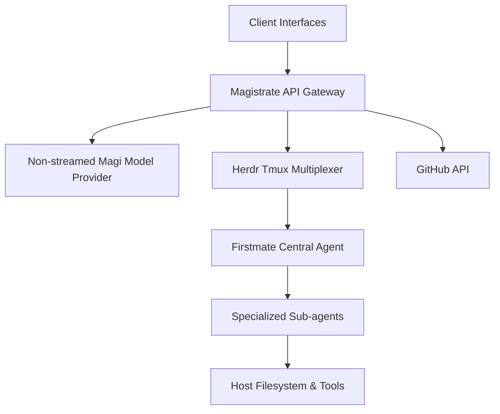

# Magistrate

**Magistrate** is a unified command center designed for multi-agent software development. 

## Vision

The broader goal of Magistrate is to make multi-agent software engineering accessible, steerable, and highly observable. Rather than juggling isolated chat windows or opaque background scripts, Magistrate provides a central interface to monitor and direct a coordinated crew of AI agents. 

Magistrate ensures that agentic workflows are:
- **Simple**: A single point of interaction for the human engineer, with meaningful escalations only when necessary.
- **Safe**: Work is isolated, operations are guarded, and merge approvals are explicitly required.
- **Observable**: Every agent's state, terminal output, and blockages remain highly visible in real-time.
- **Scalable**: Capable of supervising persistent, long-running agent domains as the fleet expands.

## Core Architecture

Magistrate acts as the integration layer between the human operator (via mobile and web interfaces) and the backend agent runners.


```mermaid
graph TD
    Client[Client Interfaces] --> Gateway[Magistrate API Gateway]
    Gateway --> Model[Non-streamed Magi Model Provider]
    Gateway --> Multiplexer[Herdr Tmux Multiplexer]
    Gateway --> GitHub[GitHub API]
    Multiplexer --> Firstmate[Firstmate Central Agent]
    Firstmate --> Subagents[Specialized Sub-agents]
    Subagents --> Host[Host Filesystem & Tools]
```

### Component Breakdown

| Component | Technology | Responsibility |
|-----------|------------|----------------|
| **Frontend** | React Native / Expo | Provides the cross-platform UI (iOS/Web) for observing agent state, reviewing PRs, and issuing commands. |
| **Gateway** | FastAPI / Python | Authenticates requests, owns native Magi chat persistence/provider calls, and exposes governed fleet data. |
| **Execution** | Firstmate structured contracts | Owns objective execution; Gateway projects persisted events and provides explicit governed actions, not terminal-derived conversation. |
| **Agents** | Claude Code / Codex | The actual autonomous entities executing commands, orchestrated by the primary `firstmate` agent. |

Phase 1 normal Chat and Voice do not route through the multiplexer or agents;
they use the direct provider edge and additive native SQLite transcript above.
Fleet reads project structured persisted events; Herdr is reserved for explicit
non-chat control seams. There is no legacy transport rollback. See
[`docs/native-chat-architecture.md`](docs/native-chat-architecture.md).

## Getting Started

### Prerequisites

- Python 3.12+ and uv
- Node.js 22.13+ and npm
- [gh CLI](https://cli.github.com/) (authenticated for PR data)
- Pinned Firstmate only for explicitly enabled execution actions

### Running Locally

1. **Clone the Repository**
   ```bash
   git clone https://github.com/melkezic/Magistrate.git
   cd Magistrate
   ```

2. **Start the API Gateway**
   The gateway relies on FastAPI and Uvicorn. Ensure your virtual environment is active.
   ```bash
   cd gateway
   uv sync --frozen
   MAGISTRATE_ENV=development uv run uvicorn app.main:app --host 127.0.0.1 --port 8000 --reload
   ```
   *Note: Ensure `.env` is configured with any necessary environment variables.*

3. **Start the Frontend Client**
   The frontend can be run as a local web application or exported statically.
   ```bash
   cd ../frontend
   npm ci
   npx expo start --web
   ```

## Development & Deployment

Current production and recovery authority: [Security and operations](docs/production-security-operations.md).
Use the Native Gateway (`cd gateway && uv sync --frozen`) and an explicit private
environment; the root Django/CLI launchers are not production entrypoints. `scripts/deploy_magistrate.sh` owns guarded Gateway
updates. There is no legacy/Pi transport rollback; Herdr is not polled by normal
product reads. See [Native Chat architecture](docs/native-chat-architecture.md).
Remaining dependency, App Store and tenant-isolation release gates are recorded
explicitly in the operations runbook; do not interpret a passing build as release approval.
