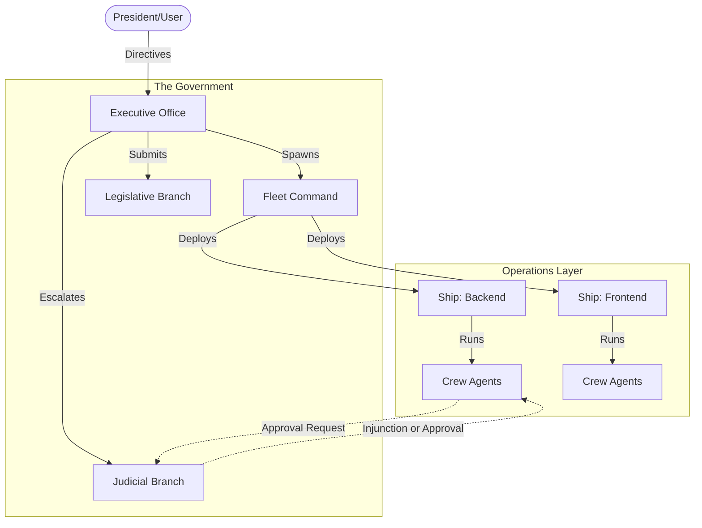

# Magistrate Architecture

Magistrate is not a chatbot or a generic agent framework. It is an **AI-native engineering government**. 

## The Metaphor

```text
User = President / Commander in Chief
Magistrate = Government / Strategic Command State
Broker = Executive Office
Agent fleets = Naval fleets / departments / field offices
Individual agents = Civil servants, engineers, inspectors
```

## System Architecture



## Core Abstractions

### 1. The Executive Branch
Powered by a Celery worker pool and Gemini, the Executive Office interprets directives from the President and issues Executive Orders. It manages the lifecycle of Fleets and Ships.

### 2. The Legislative Branch
Creates and stores persistent `Laws` and `Policies` in the PostgreSQL database. These act as hard constraints and system prompts for all spawned agents.

### 3. The Judicial Branch
Controls the execution flow. When a Crew Agent requests to execute a bash command via the `execute_bash_in_sandbox` tool, the Judicial Service opens a `CourtCase`. The case remains blocked until a `Ruling` is issued (either by an automated Security Court or by the President).

### 4. Independent Oversight
The `CensusBureau` and `IntelligenceCommunity` run background tasks to scrape the `EventLog`, calculate metrics, and provide Intelligence Briefs to the President.
