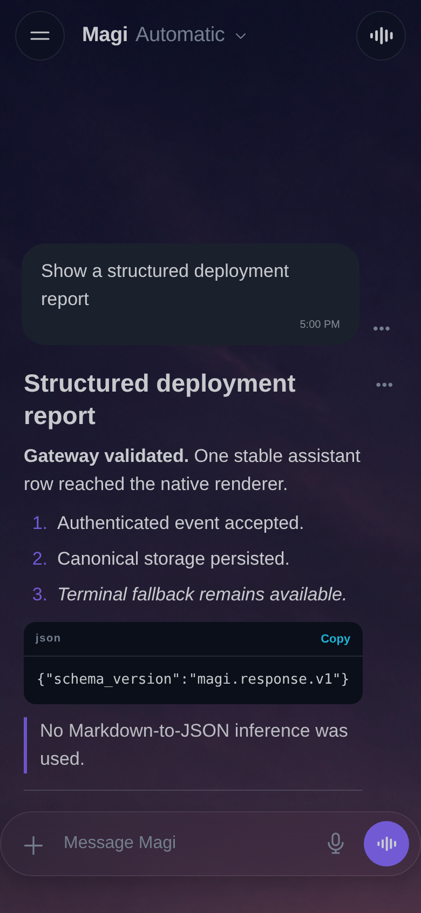

# Magi structured response v1 — live evidence

Captured on 2026-09-03 from this worktree. No bearer credential, prompt prose
from the existing Firstmate pane, or temporary SQLite database is retained.

## Authenticated semantic path

This was a real local Gateway and Expo web run, not the browser-suite mock:

1. The Gateway ran against a fresh file-backed database with development
   auto-session enabled and the notification worker disabled.
2. A canonical captain turn was seeded directly in that database. This avoids
   pretending the current Herdr text-only prompt protocol can transport the
   new opaque turn/message identity.
3. A session was issued through `POST /api/v1/auth/session`. The bearer value
   remained in one shell process and was not printed or saved.
4. Authenticated `assistant.started` revision 1 and `assistant.completed`
   revision 2 requests were posted to
   `POST /api/v1/conversations/captain/events`.
5. `GET /api/v1/conversations/captain/messages` returned one assistant row
   using the reserved id, `content_source: structured`, producer revision 2,
   all six native block types, a plain-text fallback, and `ingest_error: null`.
   The sanitized observed fields are in `gateway-live-summary.json`.
6. The unmocked Expo app loaded that Gateway at a 390×844 CSS-pixel viewport.
   DOM inspection found one structured assistant renderer, zero Markdown
   renderers for that reply, six stable block ids, one code-copy control, and
   no control for the reserved action. The result is captured in
   `01-live-gateway-structured-phone.png` (780×1688 physical pixels; SHA-256
   `15d40f60cdfafded7217049e69133ea3f9ff210862705d7e34984fca86ba3749`).

`chrome-devtools-axi` was attempted first as required, but its snapshot/eval
bridge omitted the required page id on this host. Per `frontend/AGENTS.md`, the
file capture therefore used the repository's `puppeteer-core` Chrome launcher.

## Live Herdr fallback path

A separate read-only trial called `HerdrClient.read_typed_rows('captain')`
against the installed Herdr socket. It did not prompt, interrupt, start, stop,
restart, or otherwise change an agent. The resolved pane was idle and returned
95 classified rows containing two prompt/prose segments. The newest complete
segment was replayed only into the disposable local Gateway database.

The adapter produced a 4,622-character assistant row with the id reserved by
its canonical turn, `content_source: terminal-fallback`, and no structured
document. Only SHA-256 prefixes of the live prompt and reply are retained in
`herdr-live-fallback-summary.json`; the operator conversation itself is not.
This proves the existing fallback on the real upstream read seam without
claiming that Firstmate emitted semantics it cannot yet carry.

## Automated validation

The same worktree passed the following release-aligned checks on 2026-09-03:

- `cd gateway && PYTHONPATH=. uv run pytest -q` — 255 passed;
- `cd frontend && npm test` — complete unit and browser suite passed;
- `cd frontend && npm run test:chat` — 55 passed, including the mixed
  structured/fallback phone case;
- `cd frontend && npm run typegen && npm run typecheck` — passed;
- `cd frontend && npm run lint` — 0 errors (29 pre-existing warnings);
- `cd frontend && npx expo export --platform web` — passed.

## Screenshot

